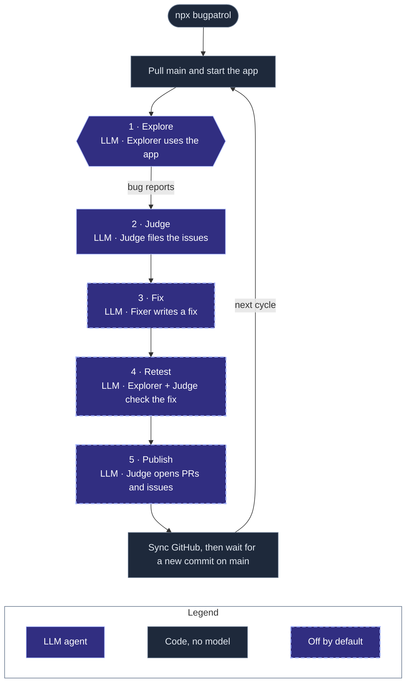

<p align="center">
  
</p>

<p align="center">
  <a href="https://www.npmjs.com/package/bugpatrol"></a>
  <a href="https://github.com/agent-labs-dev/bugpatrol/actions/workflows/ci.yml"></a>
  <a href="LICENSE"></a>
</p>

Bugpatrol is a QA team made of agents. It uses your app the way a tester does, finds bugs, fixes them, checks each fix in the running app, and opens the pull requests and issues for your team.

- An **explorer** agent runs the app, maps its screens, and reports what looks wrong.
- A **judge** agent decides which reports are real bugs, and writes the issues.
- A **fixer** agent writes a fix in its own git worktree. Then the explorer and the judge **retest** the fix in the running app.
- Bugpatrol **publishes** to GitHub: a PR for each fix, and an issue for each major bug with no fix.

It works on web apps, desktop apps (Electron), and mobile apps (iOS and Android, native or React Native). It runs on your machine, and it can run all day as a patrol.

The [Nebula](https://nebula.gg) team uses Bugpatrol every day to test our own web, desktop, and mobile apps. We made it open source, so that all teams can use it.

```bash
npx bugpatrol
```

`npx bugpatrol` runs the patrol: the full cycle, again and again: explore, judge, fix, retest, publish, and make CI green. The fixer and GitHub stay off until you turn them on.

### How the patrol runs

Three LLM agents do the work: the explorer, the judge, and the fixer. The explorer sees each screen, and also the console errors and the failed requests of the app.



[How it works](docs/how-it-works.md#the-explore-loop) shows each step of the explore loop.

- The patrol does not stop by itself. Every 30 minutes, it pulls the latest `origin/main`.
- The patrol explores and judges only when `main` has new commits. On the same commit, it skips these two steps, but it still finishes the open work: fixes, retests, publish, CI checks, and the GitHub sync. So a patrol that runs all day costs little when nobody merges code, and a fix never waits for the next merge.
- Bugpatrol keeps the last tested commit in `.bugpatrol/runs/`, so a restart also skips a commit that it tested before. To test again with no new commit, for example after a config change, use `patrol --force`.
- You can change the wait with `agents.patrol.intervalMinutes`. To stop after a number of cycles, set `agents.patrol.cycles`. To run one cycle only, use `patrol --once`.
- You can also run `patrol --once` from cron, for example every 30 minutes. Each run tests only a new commit. If the last patrol still runs, the new run does not start.
- To use a different branch, set `agents.patrol.pull`.
- Let the patrol run all the time on a dedicated computer or a cloud VM. The patrol changes the checkout of the repo, so do not run it in the checkout where you work.

When you turn on GitHub, the patrol opens GitHub issues and PRs automatically, in each cycle, with no approval step. It opens a PR for each fix, and an issue for each major bug with no fix. The PRs are drafts by default (`agents.github.pullRequests`). You can close any issue or PR: the patrol learns from it, and it does not open it again. [GitHub](docs/github.md) tells more.

## Set up with your agent

1. Install the Bugpatrol skill in your repo:

   ```bash
   npx skills add agent-labs-dev/bugpatrol
   ```

   The [skills CLI](https://github.com/vercel-labs/skills) installs the skill for Claude Code, Codex, Cursor, and many other agents. It also writes `skills-lock.json` at the repo root. Commit both, so your team gets the skill too.

2. Give this prompt to your agent:

   ```text
   Set up Bugpatrol for this repo.
   ```

The [skill](skills/bugpatrol/SKILL.md) tells the agent what Bugpatrol does, how to configure it for your app, how to run it, and how to show you the results.

If your agent cannot install skills, give it the skill URL:

```text
Read https://raw.githubusercontent.com/agent-labs-dev/bugpatrol/main/skills/bugpatrol/SKILL.md and set up Bugpatrol for this repo.
```

## Set up by hand

Bugpatrol needs two things from you: a command that launches your app on this machine, and a way to sign in (a test account, a seed script, or a dev auth bypass). [Getting started](docs/getting-started.md#before-you-start-launch-and-sign-in) tells more.

You need Node 22 or later, and `git`. Your app must be in a git repo with an `origin` remote, because each patrol cycle pulls `origin/main` and the fixer works in git worktrees. To open PRs and issues, you also need a logged-in [`gh`](https://cli.github.com) CLI.

For a web app, install Chromium for Playwright one time:

```bash
PLAYWRIGHT_SKIP_BROWSER_GC=1 npx -y playwright@1.48.2 install chromium
```

1. Run `init` in your repo. It finds your app and the LLMs on your machine, and asks which LLM each agent uses:

   ```bash
   npx bugpatrol init
   ```

   `init` puts all the Bugpatrol files in one `.bugpatrol/` folder:

   ```text
   .bugpatrol/
     bugpatrol.yml     # the config: commit it
     instructions.md    # the app guide for the explorer: commit it
     appmap.json        # the screens the explorer found: commit it
     routines/          # the routines Bugpatrol replays with no model: commit them
     runs/              # sessions, issues, fixes, and screenshots: git ignores it
   ```

2. Check `.bugpatrol/bugpatrol.yml`. It tells Bugpatrol how to start your app.

3. Write `.bugpatrol/instructions.md`. It is a plain-English note for the explorer: what the app is, how to sign in, and what never to do.
   Refer to secrets as `{{NAME}}`, and list their names in `app.secrets`. Bugpatrol never sends the real values to a model.

4. Start the patrol, and look at the results:

   ```bash
   npx bugpatrol               # explore, judge, fix, retest, publish; then check for new commits every 30 minutes
   npx bugpatrol dashboard     # http://127.0.0.1:4311
   ```

To run one step at a time, use these commands:

```bash
npx bugpatrol --once         # one cycle, then stop (add --force to test the same commit again)
npx bugpatrol explore        # the explorer maps the app and reports problems
npx bugpatrol judge          # the judge files the real bugs as issues
npx bugpatrol fix            # fix the worst issues, then retest each fix in the app
npx bugpatrol publish        # open the PRs and issues
npx bugpatrol review 123     # review one pull request of your team in the running app
```

The fixer and GitHub are off until you turn them on. [Getting started](docs/getting-started.md) shows each step in full, with Electron and mobile examples.

## Review pull requests in CI

The Bugpatrol Action runs `bugpatrol review` on each pull request. Set `agents.github.enabled: true` in `.bugpatrol/bugpatrol.yml`, add the API key of your LLM provider as a secret, and add this workflow:

```yaml
# .github/workflows/bugpatrol.yml
name: Bugpatrol
on: pull_request
permissions:
  contents: write        # the screenshots on the assets branch
  pull-requests: write   # the review
  checks: write          # only with agents.review.block: the claim check run
jobs:
  review:
    runs-on: ubuntu-latest
    steps:
      - uses: actions/checkout@v4
      - uses: agent-labs-dev/bugpatrol@v0
        env:
          OPENROUTER_API_KEY: ${{ secrets.OPENROUTER_API_KEY }}
```

`@v0` moves to each new release. On a release tag, the Action installs the bugpatrol of that release, so the Action and the CLI always match. For a fixed version, use a full tag such as `@v0.2.0`. `@main` installs `bugpatrol@latest`.

On a Blacksmith runner, change only `runs-on`, for example to `blacksmith-4vcpu-ubuntu-2404`. On your own machine, use `runs-on: self-hosted` or its labels. The Action installs Node, Bugpatrol, and Chromium for a web app. For other apps it uses what the machine has: Xvfb for a Linux desktop app, a booted emulator for Android, a Mac with a simulator for iOS. On a self-hosted Linux machine with no passwordless `sudo`, install the system libraries of Chromium first (`npx playwright install-deps chromium`).

| Input | Default | What it does |
| --- | --- | --- |
| `pr` | the pull request of the event | The pull request to review |
| `github-token` | `github.token` | The token for `gh` |
| `package` | the version of the Action tag | The Bugpatrol that npm installs: a version, a tag, or a tarball |
| `node-version` | `22` | The Node.js version |
| `working-directory` | `.` | The folder that holds `.bugpatrol/` |
| `allow-fork` | `false` | Review a pull request from a fork. Its code runs with the secrets of your app |
| `force` | `false` | Test the same commit again. Without it, a rerun on the same commit only publishes the last review again |
| `claims` | `false` | Test what the pull request says it does, also when `agents.review.claims` is off |
| `steps` | `agents.explorer.maxSteps` | The step limit of the explorer |
| `args` | | More flags for `bugpatrol review` |

The job passes when the review only comments. With `agents.review.block: true`, a claim that a replay disproved twice fails the job with exit code 1, and the claim check run on the pull request fails too ([Block a merge on a disproved claim](docs/github.md#block-a-merge-on-a-disproved-claim)). When Bugpatrol could not test, for example because the app did not start, the job fails with exit code 4. A refused fork or a config error gives exit code 2. [Review a pull request](docs/github.md#7-review-a-pull-request) tells how the review works.

## The dashboard


The dashboard shows what the agents do, live. Start it in the repo that has `.bugpatrol/`:

```bash
npx bugpatrol dashboard              # http://127.0.0.1:4311
npx bugpatrol dashboard --port 5000  # use a different port
```

The dashboard reads the files in `.bugpatrol/`, so it works during a patrol and after it. It has these pages:

| Page | What it shows |
| --- | --- |
| Overview | Each agent and its task now, the issues that need attention, the live screen, the screens found, and the token usage |
| Issues | Each issue with its screenshots and steps, the judge's reason, the fix and its diff, the retest, and the PR or issue on GitHub |
| Activity | Each session as a timeline, with one line for each action |
| Screens | A graph of how the screens connect, or a grid of the latest screenshots |
| Memory | The lessons that the agents learned |

[The dashboard](docs/dashboard.md) tells more.

## LLMs

Bugpatrol has three LLM agents:

| Agent | What it does |
| --- | --- |
| Explorer | Uses the app, maps its screens, and reports what looks wrong |
| Judge | Decides which findings are real bugs, writes the issues, and checks each fix |
| Fixer | Writes a fix in its own git worktree |

Each agent can use a different LLM:

- A local agent CLI, with your existing login: [Claude Code](https://claude.com/claude-code), [Codex](https://github.com/openai/codex), [Kimi CLI](https://github.com/MoonshotAI/kimi-cli), or [pi](https://github.com/badlogic/pi-mono).
- An API key: OpenRouter, Vercel AI Gateway, OpenAI, Anthropic, or a custom endpoint.

Give the judge your strongest model, and give the explorer a fast, low-cost model. We recommend these models:

| Agent | What it needs | Anthropic | OpenAI | Other labs (OpenRouter) |
| --- | --- | --- | --- | --- |
| Explorer | Vision, computer use, reliable tool calls, low cost | Claude Sonnet 5 | GPT-6 Luna | Gemini 3.8 Flash |
| Judge | Precision, fine visual detail, clear writing | Claude Opus 5.5 | GPT-6 Sol | Kimi K3 |
| Fixer | Strong coding, in an agent CLI | Claude Code with Claude Opus 5.5 | Codex with GPT-6 Astra | Kimi CLI with Kimi K3 |

[Which model for each agent](docs/models.md#which-model-for-each-agent) gives the `use:` config for each model.

[LLMs](docs/models.md) tells more, and shows how to configure each agent.

## What is supported

| Area | Supported |
| --- | --- |
| Platforms | Web (Playwright), Electron (CDP), iOS simulator and Android emulator (Maestro) |
| Login | Any auth system: your own setup commands plus plain-English instructions |
| Agent LLMs | Claude Code, Codex, Kimi CLI, pi, or any CLI agent; or an API key for OpenRouter, Vercel AI Gateway, OpenAI, Anthropic, or a custom endpoint |
| GitHub | PRs, issues, and state sync through the `gh` CLI |
| Output | A local dashboard, GitHub PRs and issues, and JSON files under `.bugpatrol/runs/` |

## The earlier name: Bughunters

Bugpatrol had the name Bughunters before. The old names continue to work:

- `npx bughunters` installs and runs the same version of Bugpatrol. `npx bughunters patrol` is the same as `npx bugpatrol`.
- A repo with `.bughunters/bughunters.yml` keeps that folder. Bugpatrol reads it when the repo has no `.bugpatrol/bugpatrol.yml`.
- The `BUGHUNTERS_*` environment variables work when the `BUGPATROL_*` variable with the same name is not set.
- The GitHub sync also finds the PRs and issues that have the `bughunters` label.
- `data-bughunters-safe` and `data-bughunters-destructive` have the same effect as the `data-bugpatrol-*` attributes.

To move a repo to the new names, rename `.bughunters/` to `.bugpatrol/` and `bughunters.yml` to `bugpatrol.yml`. Then change the `.gitignore` line to `.bugpatrol/runs/`.

## Documentation

| Page | What it covers |
| --- | --- |
| [Getting started](docs/getting-started.md) | Add Bugpatrol to your repo, step by step |
| [LLMs](docs/models.md) | What each agent does, and the providers for each agent |
| [Configuration](docs/configuration.md) | All the settings in `.bugpatrol/bugpatrol.yml` |
| [Commands](docs/commands.md) | All the CLI commands |
| [GitHub](docs/github.md) | Set up the PRs and issues, look at the reports first, sync the state back, and review a pull request |
| [The dashboard](docs/dashboard.md) | What each page shows, and the files behind it |
| [How it works](docs/how-it-works.md) | The cycle, noise control, memory, GitHub, and safety |
| [The deterministic gate](docs/deterministic-gate.md) | `bugpatrol run`: a merge gate for web apps that uses no agent |
| [Development](docs/development.md) | Build Bugpatrol from source, the packages, and the examples |

## License

[Apache-2.0](LICENSE)

---

<p align="center">Made with ❤️ by the <a href="https://nebula.gg">Nebula</a> team.</p>
