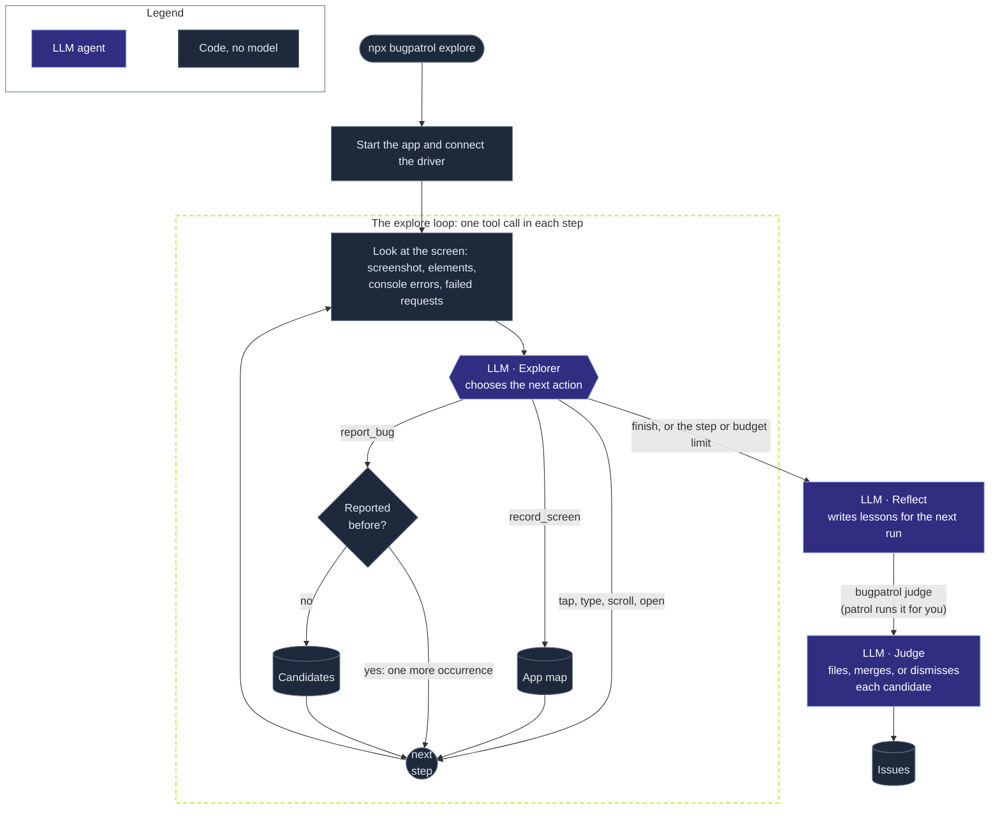

# How it works

## The agents

- An **explorer** agent runs the app, maps its screens, and reports what looks wrong.
- A **judge** agent decides which findings are real bugs, and writes the issues.
- A **fixer** agent writes a fix in its own git worktree.
- The explorer and the judge then **retest** the fix in the running app, with before and after screenshots.
- The judge **publishes** to GitHub: a PR for each fix, and an issue for each major bug with no fix.

## The cycle

A patrol cycle has these steps:

1. **Pull** fetches `origin/main` and checks out its latest commit in the source repository, so each cycle tests the latest code. The checkout is a detached `HEAD`: your local `main` does not change, and the pull works in a linked worktree. Set `agents.patrol.pull` to use a different branch, or to `false` to keep the checkout as it is. If the checkout has uncommitted changes, the cycle uses the current checkout. If the commit is the same as in the last full cycle, the patrol skips the explore and the judge. It still runs the fixes, the retests, publish, the CI checks, and the GitHub sync, so the open work continues.
2. **Setup** runs your commands and connects the driver to the app.
3. The **explorer** enters the app (with the `enter-app` routine when it can), records screens, and reports problems. With each screen, it also gets the console errors and the failed requests of the app.
4. The **judge** looks at each finding with its screenshot. It files an issue, adds the finding to an issue that is already open, or dismisses it with a reason.
5. **Teardown** stops the app.
6. The **fixer** fixes the worst issues. Each fix gets a **retest**: Bugpatrol starts the app from the fix worktree, the explorer repeats the flow on each affected screen, and the judge compares before and after.
7. The judge **publishes**. A verified fix becomes a PR. A major bug with no fix becomes an issue. The judge skips an item that a Bugpatrol PR or issue on GitHub already covers.
8. Bugpatrol watches the **CI** checks of each PR. When a check fails, the fixer fixes it and pushes a new commit, until the checks are green.

## The explore loop

The explorer uses the app one step at a time. In each step, it looks at the screen and calls one tool. Each result also lists the console errors and the failed requests since the last step, so the explorer can report an error that the screenshot does not show. Each bug report becomes a candidate for the judge.

## Automatic checks

The automatic checks (contrast, tap size, overlap, and more) are off by default. You can turn on some of them with `agents.checks`. Then each check runs on each screen that the explorer records, and each finding goes to the judge. Refer to [Configuration](configuration.md#automatic-checks).

## Noise control

Bugpatrol keeps the list of issues short:

- With the automatic checks on, one rule on one screen gives one finding, not one finding for each element.
- Each finding has a fingerprint. A finding that the judge filed or dismissed before does not go to the judge again. A filed finding adds one more occurrence to its issue.
- The judge looks for one shared cause first, so ten screens that fail in the same way become one issue.
- A dismissed issue does not come back. A fixed issue that comes back reopens as a regression.
- A merged fix gets a recheck on the main branch.
- If you turn on the automatic checks, an issue from a check closes by itself after 3 visits with no finding.

## Memory

Bugpatrol learns in three ways, and it writes each lesson to `.bugpatrol/runs/memory.json`:

- **The agents save lessons while they work.** The explorer, the judge, and the fixer each have a `save_lesson` tool. They save a lasting fact that a later session needs, for example "a component with a `.web.tsx` file needs the change there too". A role can save a lesson for another role: the judge can save one for the fixer.
- **After each explorer session,** Bugpatrol reads what went wrong: failed taps, retyped fields, broken routines. Then it writes short lessons for the explorer.
- **Events become lessons:** human dismissals, fixer declines, rejected PRs, commit hook errors, and failed verify commands.

When a fix does not work in the running app, the fixer's next attempt must first find why, and save that cause as a lesson. Each role gets its lessons in its prompt, so the next run does not repeat the same mistakes. You do not have to add a lesson by hand, but you can, with `bugpatrol memory add`. Set `agents.memory.enabled: false` to turn all of this off.

## GitHub

The judge writes a short summary. Bugpatrol adds the full report: the steps, the screenshots, the fix, and the before and after table. It uploads the images to the orphan `bugpatrol-assets` branch, so the images never enter the PR diff. PR titles use the Conventional Commits form, for example `fix(app): expand the sidebar in a narrow window`. When the team closes a PR without a merge, Bugpatrol does not propose that change again. Bugpatrol never force-pushes and never uses `--no-verify`.

## Pull request review

`bugpatrol review <pr>` uses the same agents on a pull request of your team. The explorer tests what the diff can affect on the pull request build. Bugpatrol then starts the app from the merge base, and the explorer repeats the flow of each report there. The judge compares the two builds, and the comment on the pull request puts first what the pull request introduces. A review never blocks a merge, and it writes nothing to the app map, the routines, or the memory. Refer to [GitHub](github.md#7-review-a-pull-request).

## Safety

- The fixer works only in its own worktree.
- A human decision (a dismissal, a closed PR) is never overwritten.
- Secrets never reach a model or a log.
- `app.instructions` can list what the explorer must never do.
- A review runs the code of a pull request, so it refuses a pull request from a fork unless you add `--allow-fork`.

The full design is in [ADR 0005](adr/0005-agents-drivers-and-the-patrol.md).
